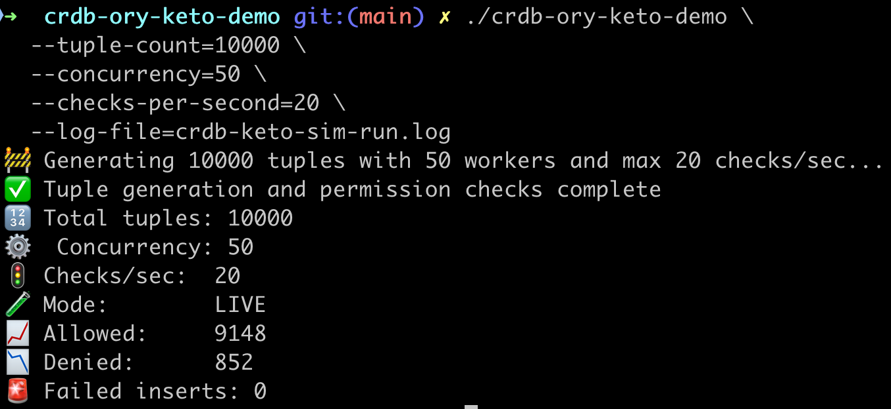

# crdb-ory-keto-demo

A workload simulator for [Ory Keto](https://www.ory.sh/keto) + [CockroachDB](https://www.cockroachlabs.com/), designed for performance benchmarking, access control validation, and large-scale POC demos.

This tool inserts relation tuples into CockroachDB, mirrors them to Ory Keto’s HTTP API, and performs real-time permission checks.

---

## 🚀 Features

- ✅ High-throughput **tuple ingestion** into CockroachDB
- ✅ **Keto HTTP API** integration (`PUT /admin/relation-tuples` and `POST /relation-tuples/check`)
- ✅ **Concurrency & throttling** controls (via CLI)
- ✅ **Prometheus metrics**: insert latency, check counts
- ✅ **Dry-run** mode: skip external calls, useful for perf/load planning
- ✅ **Log to file** for analysis/replay/debug
- ✅ **Flexible config** and CLI overrides
- ✅ Works with:
  - CockroachDB (local, on-prem, or cloud)
  - Ory Keto (v0.14.0+)
  - Docker or standalone installs

---

## ⚙️ Configuration

### 📁 `config/config.yaml`

```yaml
database:
  url: "postgresql://root@localhost:26257/defaultdb?sslmode=disable"

keto:
  base_url: "http://localhost:4466"

workload:
  tuple_count: 1000
  concurrency: 10
  checks_per_second: 5
````

---

## 🛠 CLI Flags

Override any config value via command-line:

| Flag                  | Description                                       |
|-----------------------|---------------------------------------------------|
| `--init-schema`       | Creates required tables in the database and exits |
| `--tuple-count`       | Number of tuples to insert                        |
| `--concurrency`       | Number of goroutines for load                     |
| `--checks-per-second` | Max checks/sec per worker                         |
| `--log-file`          | Write logs to file                                |
| `--dry-run`           | Simulate load without DB/API calls                |
| `--verbose=false`     | Disable logging completely                        |
| `--summary`           | Show summary config and exit                      |

---

## 🧪 Examples

### Dry run 5k tuples with 20 workers:

```bash
go run cmd/main.go --tuple-count=5000 --concurrency=20 --dry-run
```

### Full test with cloud CockroachDB:

```bash
DATABASE_URL="postgresql://root@<host>:26257/defaultdb?sslmode=require" \
go run cmd/main.go --tuple-count=10000 --concurrency=50 --checks-per-second=10
```

Run with verbose output:
````gotemplate
./crdb-ory-keto-demo --tuple-count=1000 --concurrency=10 --checks-per-second=5
````

Run quietly and log to file:
````gotemplate
./crdb-ory-keto-demo --tuple-count=10000 --concurrency=50 --log-file=run.log --verbose=false
````


### Log to file:

```bash
go run cmd/main.go --log-file run.log
```

---

## 🔍 Validation

### Logging output (live or in file):

```
✅ Tuple inserted into CockroachDB: user-1 -> doc-1001
📤 Tuple mirrored to Keto successfully
🔒 Permission check result: allowed=true
```

### Summary report:

```
✅ Tuple generation and permission checks complete
🔢 Total tuples: 1000
⚙️  Concurrency: 10
🚦 Checks/sec:  5
🧪 Mode:        LIVE
📈 Allowed:     999
📉 Denied:      0
🚨 Failed inserts: 0
```

---

## 📊 Prometheus Metrics

Available at [http://localhost:2112/metrics](http://localhost:2112/metrics)

* `tuple_insert_duration_seconds`
* `permission_check_total{result="allowed|denied"}`

Add to Grafana for real-time dashboards.

---

## 🧪 Run Everything with a Script

```bash
./scripts/run.sh
```

This script:

* Starts Docker containers
* Applies DB schema
* Runs the simulator

---

## 🧼 Clean Shutdown

```bash
docker compose down -v
rm run.log
```

---

### 🛠️ Build as a CLI Binary

You can build and distribute the simulator as a standalone CLI:

```bash
make build
```

The compiled binary `crdb-ory-keto-demo` can then be run directly:

```bash
./crdb-ory-keto-demo --help
```

### Cross-platform builds:

```bash
make build-linux     # For Linux x86_64
make build-mac       # For macOS ARM64 (Apple Silicon)
make build-windows   # For Windows x86_64
```

### Clean up all binaries:

```bash
make clean
```

---

### 🧪 Example usage with binary

This will create the following tables:
* keto_relation_tuples
* keto_uuid_mappings
```bash
DATABASE_URL="postgresql://<user>@<host>:26257/defaultdb?sslmode=require" \
./crdb-ory-keto-demo --init-schema
```
```bash
./crdb-ory-keto-demo \
  --tuple-count=10000 \
  --concurrency=50 \
  --checks-per-second=20 \
  --log-file=crdb-keto-sim-run.log
```

The binary will:

* Connect to the database using `DATABASE_URL` or config fallback
* Mirror tuples to Keto via HTTP
* Perform permission checks with real responses
* Output summary stats and logs

---

## 🖥️ Sample Run Output

Here's an example run with 10,000 tuples, 50 workers, and 20 checks/sec:



---

### 🧪 Benchmarking Load & Throughput

You can run predefined load tests using the included `benchmark.sh` script. This helps measure:

* Ingestion throughput to CockroachDB
* Permission check throughput via Ory Keto
* Total run time
* Success/failure breakdown

---

### 📁 `scripts/benchmark.sh`

This script will:

* Run a matrix of test cases (tuples × concurrency × checks/sec)
* Time each run
* Save logs per test
* Append results to `benchmark_results.csv`

---

### ✅ Example Matrix (can be modified)

```bash
matrix=(
  "1000 5 5"
  "5000 10 10"
  "10000 20 20"
  "25000 50 25"
)
```

---

### ▶️ To Run

```bash
./scripts/benchmark.sh
```

---

### 📝 Results Format (CSV)

Each run adds a row to `benchmark_results.csv`:

```csv
timestamp,db_type,tuple_count,concurrency,checks_per_sec,duration_sec,allowed,denied,failed
2025-06-04T19:15:00,CockroachDB,1000,5,5,8,999,1,0
```

---

### 📁 Per-Run Logs

Each test writes its own log to:

```
bench_<tuple_count>_<concurrency>.log
```

Example:

```bash
tail -f bench_10000_20.log
```
